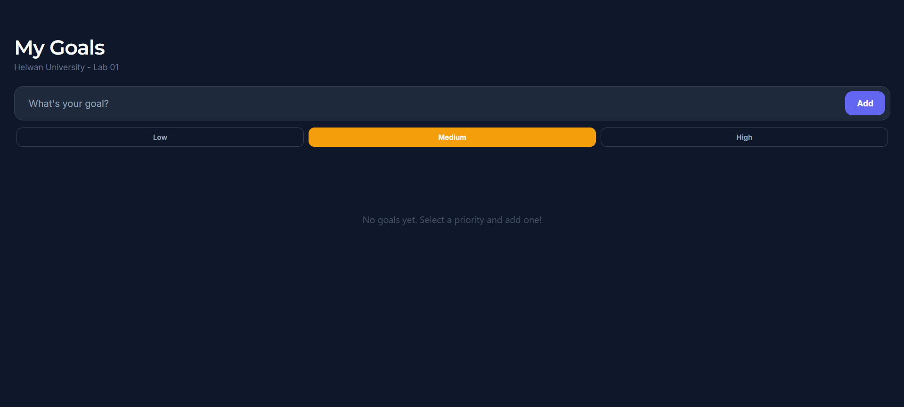
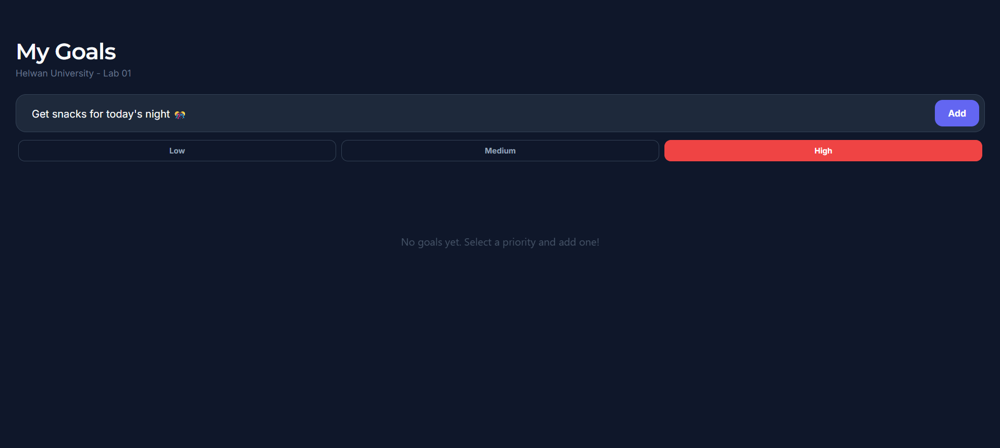
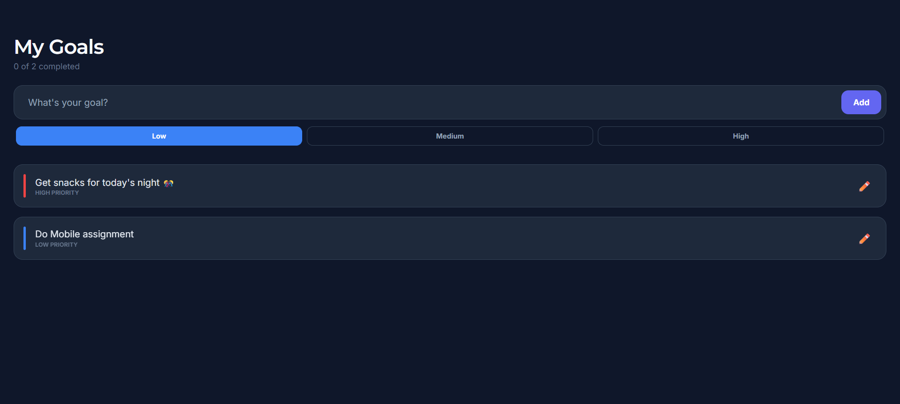

# Assignment 01: To-Do List Report

**Student Name:** [Your Name Here]
**Course:** Mobile Application Development
**University:** Helwan University (FEHU)

## Color Palette
- **Background:** `#0f172a` (Deep Slate)
- **Primary/Accent:** `#6366f1` (Indigo)
- **Secondary Surfaces:** `#1e293b` (Slate 800)
- **Text (Primary):** `#f8fafc`
- **Text (Secondary):** `#64748b`

## Fonts Used
- **Montserrat SemiBold**: Used for main headers for a premium, clean look.
- **Inter Regular/Bold**: Used for body text and interactive elements for high readability.

## Features
- Custom integrated Google Fonts via Expo.
- Premium dark mode design with glassmorphism touches.
- Add/Remove goals functionality.
- Scrolling list using `FlatList`.

## Screenshots
> [!NOTE]
> Add your screenshots here. You can drag and drop images into this folder and link them below.

1. **Empty State**: 
2. **Adding Goal**: 
3. **List View**: 

## Runtime Video
- **Link:** [Insert YouTube/Google Drive Link Here]

## Expo Snack Link
- **Link:** [Insert Expo Snack Link Here]
